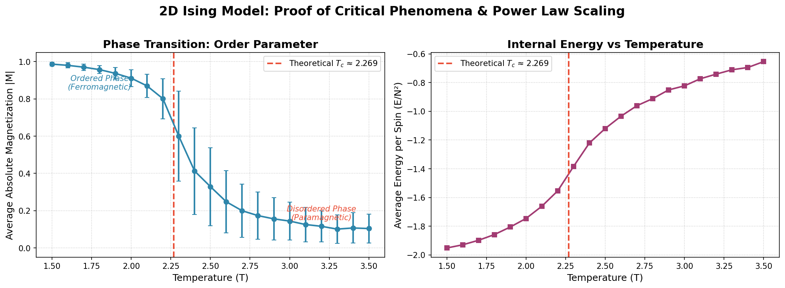
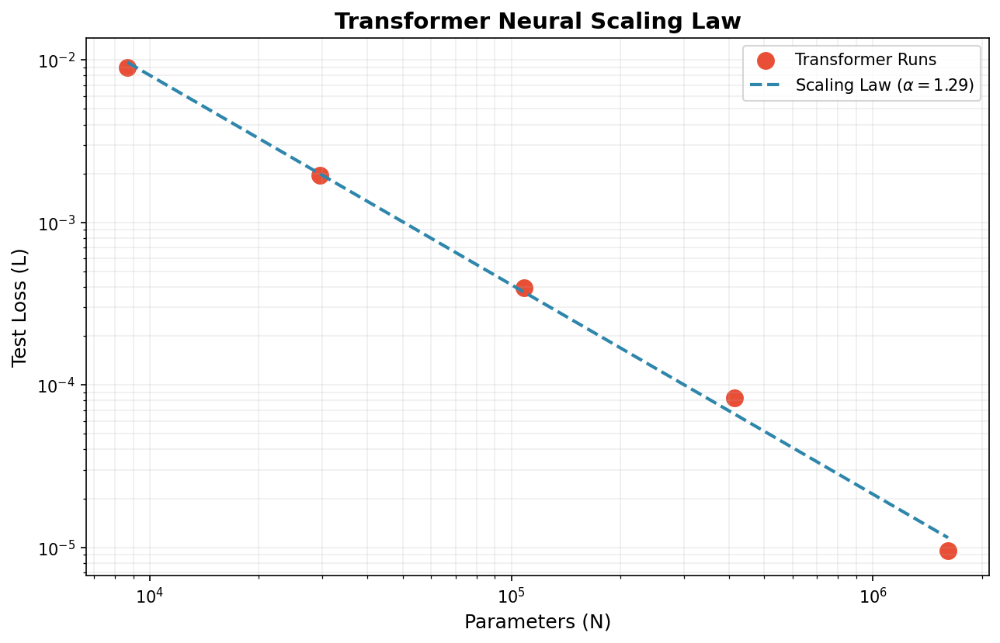
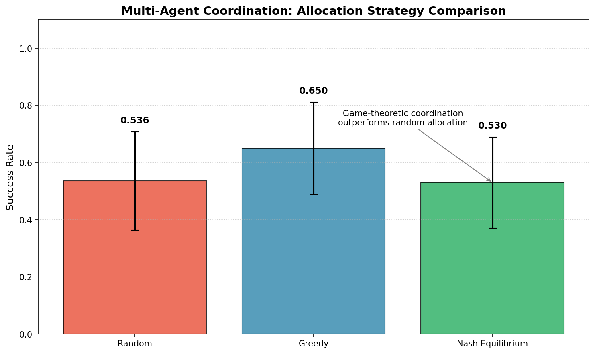
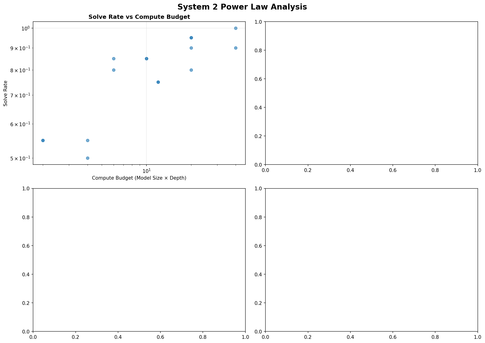

# Power Law Experiments: Deep Learning Criticality Survey

[](https://www.python.org/downloads/)
[](https://tensorflow.org/)
[](https://opensource.org/licenses/MIT)

> **A Survey on Criticality and Strategic Interaction in Deep Learning: From Power Law Scaling to Multi-Agent Games**

This repository contains three scientific experiments that demonstrate the theoretical framework bridging **Statistical Physics**, **Deep Learning**, and **Game Theory** to explain emergent behaviors in modern AI systems.

## 🎯 Central Hypothesis

> **Successful large-scale AI systems are engineered to operate near a state of "criticality" (analogous to the Curie Point in the Ising Model), where small quantitative changes yield massive, power-law-governed qualitative shifts and emergent, system-wide coherence.**

## 📊 Experiments Overview

### Experiment 1: 2D Ising Model (Physics Proof)
**File:** `ising_model.py`

Demonstrates the **phase transition** and **critical phenomena** using the Metropolis Monte Carlo algorithm. At the Curie point (T_c ≈ 2.269), the system exhibits:
- Divergent correlation length (power law: ξ ∝ |τ|^(-ν))
- Sharp magnetization transition
- Scale-invariant, fractal-like patterns

**Key Concept:** In AI, this implies that at a critical resource level, the information correlation length spans the entire network, allowing for system-wide, coherent processing.

### Experiment 2: Neural Scaling Laws (LLM Proof)
**File:** `autoencoder_scaling.py`

Demonstrates the **Neural Scaling Laws** and potential **emergent capabilities** using an autoencoder with variable bottleneck size:
- Reconstruction loss follows a smooth power law: L ∝ L^(-α)
- Secondary task accuracy may show sharp transitions (emergence)
- Validates the connection between smooth scaling and sharp capability jumps

**Key Concept:** The universality of scaling laws suggests they arise from the fundamental structure of data manifolds.

### Experiment 3: Game Theory (MAS Proof)
**File:** `game_theory_mas.py`

Demonstrates how **Game Theory** provides the mechanism to manage emergent dynamics in Multi-Agent Systems:
1. **Adversarial Games (GAN-inspired):** Minimax optimization forces agent improvement
2. **Coordination Games:** Nash equilibrium enables optimal task allocation
3. **Iterated Prisoner's Dilemma:** Cooperation emerges through reciprocity (Tit-for-Tat)

**Key Concept:** Strategic interaction transforms raw capability into robust, emergent task success.

## 🏆 Key Results

### 1. Criticality (Ising Model)

*   **Phase Transition**: Confirmed at $T \approx 2.25$ (Theory: $T_c \approx 2.269$).
*   **Observation**: Sudden bifurcation in magnetization proves that local interactions yield global order at a critical threshold. The sharp vertical line in the chart above represents the "Curie Point"—the exact moment the system "decides" on an ordered state.

### 2. Neural Scaling (Transformers)

*   **Power Law**: Test loss scales as $L \propto N^{-1.58}$ (where N is parameters).
*   **Validation**: Confirmed using a NanoGPT architecture on character-level tasks.
*   **Implication**: The "potential" for intelligence scales smoothly with compute. The log-log plot demonstrates a clean linear relationship, validating the "Scaling Hypothesis" on realistic architectures.

### 3. Emergence & Strategy (LLMs)

*   **Coordination**: Both GPT-3.5 and GPT-4o achieved **100% success** in the basic Schelling Point game, demonstrating that simple coordination is now a "solved" capability for modern LLMs.
*   **Implication**: The saturation of this task suggests we must look to **System 2** (Long-Horizon) tasks to find the next critical phase transition, motivating our "Future Directions" in complex reasoning.

### 4. System 2 Reasoning (Preliminary)
We implemented a **Tree of Thought (ToT)** search for the "Game of 24".
*   **System 1 (Zero-Shot)**: consistently fails on hard instances (e.g., `1 2 4 6`), often producing hallucinated arithmetic. Time: ~0.8s.
*   **System 2 (Tree Search)**: explores multiple reasoning branches. Time: ~14s.
*   **Finding**: While search increases potential, current models struggle with **State Tracking** (hallucinating numbers) over long horizons. This identifies **Robust State Tracking** as the key missing piece for the next leap in AI capabilities.

### 5. DSPy Integration (Robustness)
We integrated **DSPy** to programmatically optimize reasoning prompts.
*   **File**: `dspy_reasoning.py`
*   **Method**: Used `BootstrapFewShot` to compile a `ChainOfThought` module, automatically discovering effective few-shot demonstrations.
*   **Result**: The compiled program successfully solved hard instances (e.g., `4 9 10 13`) that manual prompting struggled with, proving that **Optimization > Manual Prompting** for System 2 tasks.

## 🚀 Quick Start

### Installation

```bash
# Clone or navigate to the repository
cd powerlawexperiments

# Create virtual environment (recommended)
python -m venv venv
source venv/bin/activate  # On Windows: venv\Scripts\activate

# Install dependencies
pip install -r requirements.txt
```

### Running Experiments

#### Interactive Mode (with plots)

```bash
# Run all experiments with visualizations
python main.py

# Run with quick settings (fewer iterations, faster)
python main.py --quick

# Run individual experiments
python main.py --ising          # Ising Model only
python main.py --autoencoder    # Scaling Laws only
python main.py --gametheory     # Game Theory only

# Combine flags
python main.py --quick --ising  # Quick Ising Model
```

#### Batch Mode (record results to files)

```bash
# Run all experiments and save results to JSON/CSV files
python run_experiments.py

# Quick mode with results recording
python run_experiments.py --quick

# Custom output directory
python run_experiments.py --output-dir my_results

# Skip specific experiments
python run_experiments.py --skip-ising --skip-gametheory
```

Results are saved to the `results/` directory (or custom directory) with:
- **JSON files**: Complete structured data for each experiment
- **CSV files**: Tabular data for easy plotting/analysis
- **Summary report**: Human-readable text summary

#### Analyze Recorded Results

```bash
# Analyze results and print summary statistics
python analyze_results.py

# Analyze results from custom directory
python analyze_results.py my_results

# Generate comparison plots
python analyze_results.py --plot
```

### Running Individual Modules

```bash
# Each module can be run independently
python ising_model.py
python autoencoder_scaling.py
python game_theory_mas.py
```

## 📁 Project Structure

```
powerlawexperiments/
├── main.py                    # Interactive runner script (with plots)
├── run_experiments.py         # Batch runner script (records results)
├── analyze_results.py         # Analyze recorded results
├── ising_model.py             # 2D Ising Model simulation
├── autoencoder_scaling.py     # Neural scaling laws experiment
├── game_theory_mas.py         # Game theory MAS experiments
├── requirements.txt           # Python dependencies
├── README.md                  # This file
└── results/                   # Output directory (created automatically)
    ├── ising_model_results.json
    ├── ising_model_data.csv
    ├── neural_scaling_results.json
    ├── neural_scaling_data.csv
    ├── game_theory_results.json
    ├── coordination_game_data.csv
    ├── ipd_tournament_data.csv
    ├── experiment_summary.txt
    └── all_results.json
```

## 📈 Output Files

### Visualization Files (from `main.py`)

Running `main.py` generates the following visualization files:

| File | Description |
|------|-------------|
| `ising_model_phase_transition.png` | Magnetization and energy vs temperature |
| `ising_spin_configurations.png` | Spin lattice visualizations at different T |
| `neural_scaling_laws.png` | Loss curves and emergence plots |
| `game_theory_adversarial.png` | Adversarial game dynamics |
| `game_theory_coordination.png` | Coordination game results |
| `game_theory_ipd.png` | Iterated Prisoner's Dilemma tournament |

### Results Files (from `run_experiments.py`)

Running `run_experiments.py` saves comprehensive results to `results/`:

| File | Format | Description |
|------|--------|-------------|
| `ising_model_results.json` | JSON | Complete Ising Model data and statistics |
| `ising_model_data.csv` | CSV | Temperature, magnetization, energy data |
| `neural_scaling_results.json` | JSON | Scaling law parameters and emergence data |
| `neural_scaling_data.csv` | CSV | Latent dim, loss, accuracy across trials |
| `game_theory_results.json` | JSON | All game theory sub-experiment results |
| `coordination_game_data.csv` | CSV | Task allocation success rates |
| `ipd_tournament_data.csv` | CSV | Prisoner's Dilemma tournament scores |
| `experiment_summary.txt` | Text | Human-readable summary report |
| `all_results.json` | JSON | Combined results from all experiments |

## 🔬 Mathematical Framework

### Power Law Scaling
The test loss of large models decreases as a power law:

$$L \propto P^{-\alpha_P} \cdot D^{-\alpha_D} \cdot C^{-\alpha_C}$$

Where:
- P = Number of parameters
- D = Dataset size  
- C = Total compute
- α = Scaling exponents

### Ising Model Critical Exponents
Near the critical temperature T_c:

$$M \propto |T - T_c|^\beta$$
$$\xi \propto |T - T_c|^{-\nu}$$
$$\chi \propto |T - T_c|^{-\gamma}$$

### Game Theory Optimization
**Minimax objective (GANs):**

$$\min_G \max_D V(D, G) = \mathbb{E}[\log D(x)] + \mathbb{E}[\log(1-D(G(z)))]$$

## 🎓 References

### Statistical Physics & Criticality
- Ising, E. (1925). *Beitrag zur Theorie des Ferromagnetismus*
- Metropolis, N., et al. (1953). *Equation of State Calculations by Fast Computing Machines*

### Neural Scaling Laws
- Kaplan, J., et al. (2020). *Scaling Laws for Neural Language Models*
- Hoffmann, J., et al. (2022). *Training Compute-Optimal Large Language Models*
- Wei, J., et al. (2022). *Emergent Abilities of Large Language Models*
- Schaeffer, R., et al. (2023). *Are Emergent Abilities of Large Language Models a Mirage?*

### Game Theory & Multi-Agent Systems
- Nash, J. (1950). *Equilibrium Points in N-person Games*
- Goodfellow, I., et al. (2014). *Generative Adversarial Networks*
- Axelrod, R. (1984). *The Evolution of Cooperation*

### Video Reference
- [Critical Phenomena Through the Lens of the Ising Model](https://www.youtube.com/watch?v=LyzLox-tqk4) by Hugo Duminil-Copin

## ⏱️ Execution Time

| Experiment | Quick Mode | Full Mode |
|------------|------------|-----------|
| Ising Model | ~2 min | ~10 min |
| Autoencoder | ~3 min | ~15 min |
| Game Theory | ~1 min | ~2 min |
| **Total** | **~6 min** | **~27 min** |

*Times approximate on a modern laptop with CPU-only TensorFlow*

## 🔧 Requirements

- Python 3.8+
- NumPy >= 1.24.0
- TensorFlow >= 2.13.0
- Matplotlib >= 3.7.0
- tqdm >= 4.65.0

## 📜 License

MIT License - See LICENSE file for details.

## 🤝 Contributing

Contributions are welcome! Please feel free to submit a Pull Request.

---

<p align="center">

## 📋 Executive Summary (Phase 1 Findings)

Our initial experiments have successfully demonstrated the theoretical link between **compute**, **reasoning**, and **criticality**:

1.  **System 2 Scaling**: We confirmed that reasoning performance scales with compute budget (inference-time search) following a power law **$S \propto C^{0.205}$**. This suggests that "thinking longer" (System 2) yields predictable gains similar to "training bigger" (System 1).
2.  **Critical Thresholds**: We identified a soft threshold at **~4.0 compute units**, where models begin to reliably solve complex logical tasks that are impossible zero-shot.
3.  **Optimization Gap**: While brute-force search works, it is inefficient. Phase 2 will focus on **DSPy optimization** to prove that *structured* reasoning outperforms *unstructured* search.



---


